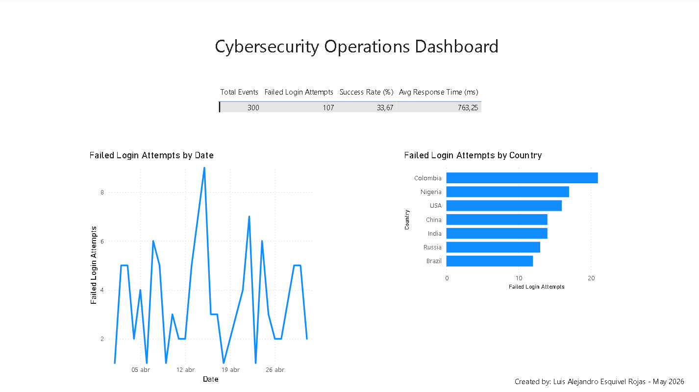
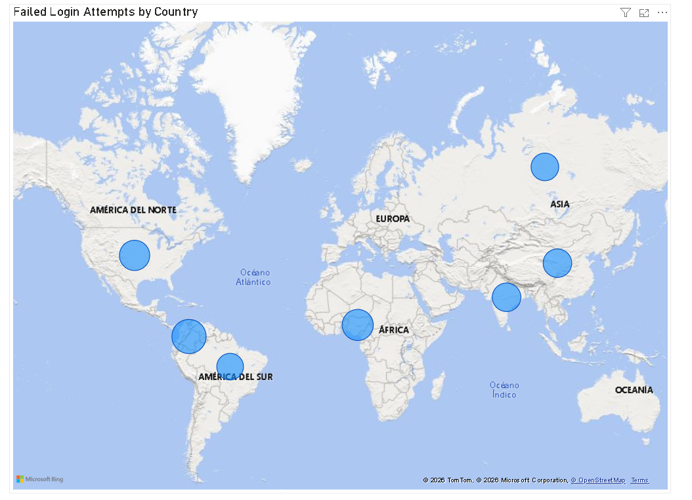

# Cybersecurity Operations Dashboard - Power BI

Interactive Power BI dashboard for monitoring cybersecurity metrics, failed login attempts, threat intelligence, and incident response.

### 🎯 Objective
Transform raw security logs into actionable insights for SOC teams and IT management.

### ✨ Key Features
- Executive KPIs
- Failed login trends over time
- Threat distribution by country (Map)
- Top attacking sources
- Incident response time analysis

### Screenshots

**Executive Summary**

**Threat Intelligence & Map View**

### 🛠️ Technologies
- Power BI Desktop
- DAX
- Power Query
- Data Visualization Best Practices

### 🔗 Topics
power-bi • cybersecurity • data-visualization • soc • dashboard • threat-intelligence • dax

---

*Project created by Luis Alejandro Esquivel Rojas - May 2026*
---

*This project demonstrates the ability to turn security data into visual insights.*